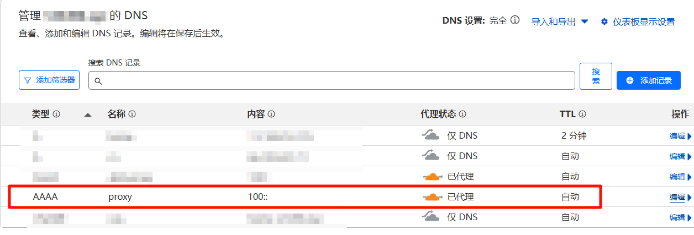

 利用Cloudflare CDN的稳定网络为绝大部分`http`与`ws`链接进行加速，不支持IP链接。

**前置条件**  

- cloudflare账号
- 托管在cloudflare上的域名

## 部署

先创建1个Workers应用程序，然后找到创建的应用程序并编辑代码


替换以下代码并部署

```js
export default {
  async fetch(request) {
    let url = new URL(request.url);
    url = new URL(`${url.pathname.slice(1)}${url.search}`);
    return fetch(new Request(url,request));
  }
};
```

## 绑定域名

> Workers提供的`.workers.dev`域名国内无法访问，需通过未被屏蔽的域名访问Workers程序

参照图片创建DNS记录，名称随意



参照图片将域名与Workers进行绑定

- 路由：假设你的域名为`example.com`，创建的dns记录为`proxy`，那么路由为`proxy.example.com/*`
- Worker：之前部署的应用程序


## 使用

> 代理域名 + 目标链接
>
> https://代理域名/目标链接

假设Worker程序的域名为`proxy.example.com`，目标链接为`https://www.baidu.com`，则代理链接为`https://proxy.example.com/https://www.baidu.com`

****

使用场景举例

```ini
# GitHub下载加速
https://proxy.example.com/https://raw.githubusercontent.com/gohugoio/hugo/master/LICENSE
# Telegram机器人调用
https://proxy.example.com/https://api.telegram.org/bot123:456
# Websocket
wss://proxy.example.com/https://example.com/ws.
```

